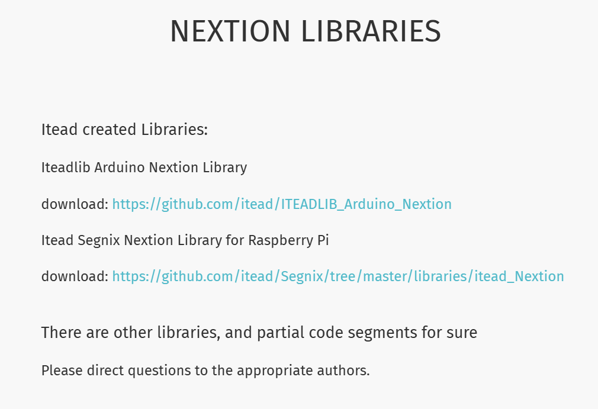
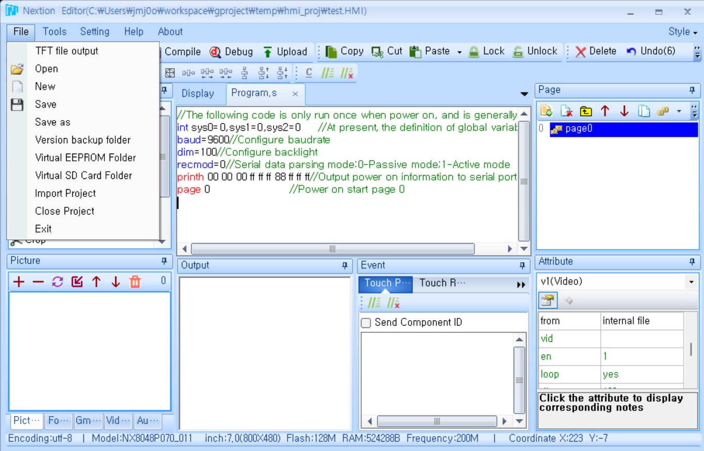
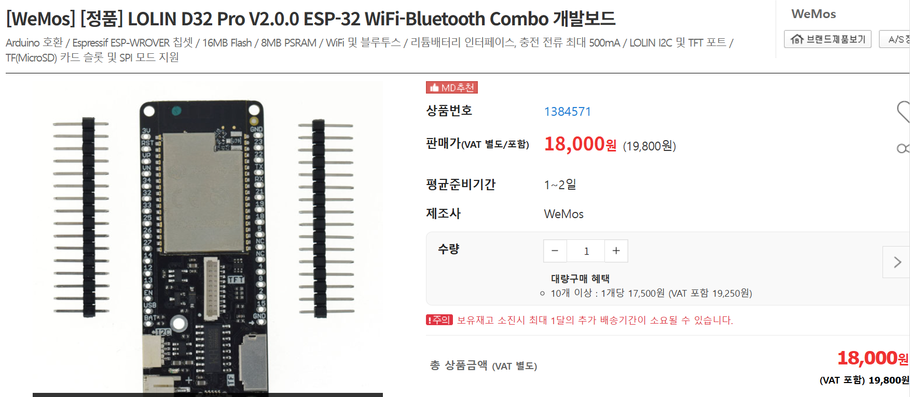
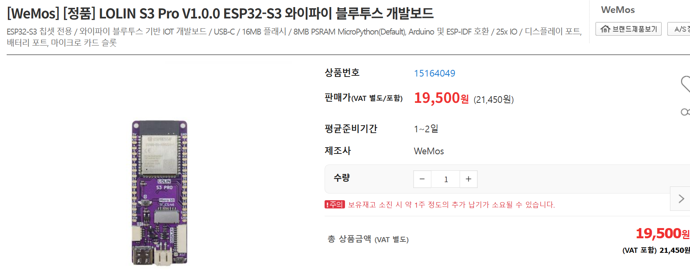
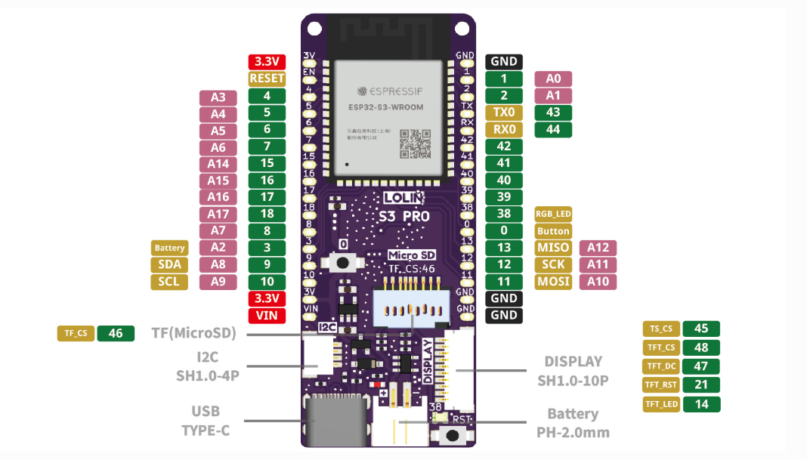

# 🔎 하드웨어 조사

## 시스템 환경 분석

- Nextion NX8048P070-011C

    - 200MHz 온보드 프로세서와 512KB RAM, 128MB 플래시 메모리를 탑재한 Human Machine Interface 디스플레이(이하 HMI)로, 터치 입력을 지원함

    - 외부 인터페이스로 FAT32 포맷 SD카드 소켓과 4핀 TTL 시리얼 포트, 8개의 다목적 IO 포트(GPIO / Arduino의 디지털 포트와 유사)를 포함. Arduino와 연결 시에는 TTL 포트를 RS232 컨버터를 통해 변환(전압 수준 다름)하여 사용하는 것으로 추측됨

    - 제조사 Nextion은 산업용 임베디드 디스플레이 솔루션 분야에서 꽤 알려진 회사로, 자사 제품에 사용될 GUI 프로그램을 개발할 수 있는 Nextion Editor를 제공함. **요구사항에서 의미하는 ’펌웨어’는 해당 HMI에서 구동될 GUI 프로그램을 의미하는 것으로 생각됨**

    - 현재 Bartooler가 사용하는 펌웨어는 설정 화면에서 커피 / 물의 추출 시간을 설정하고, 최대 5개까지 저장 가능한 디스플레이(대기 화면)를 선택할 수 있음

    - 사용자가 화면에 등장할 디스플레이를 업데이트하고 싶으면 우선 사용할 이미지/비디오를 PTG컴퍼니 측에 직접 의뢰하고, 사측에서 해당 컨텐츠를 출력하는 펌웨어를 새로 생성하여 tft 파일을 제작, 이를 SD카드 슬롯을 통해 업로드하는 방식을 사용하고 있음

    - **내부에 무선 네트워크 관련 모듈을 포함하고 있지 않고, Arduino와 통신하기 위한 TTL 포트를 제외하면 Wi-Fi 모듈 연결 가능 시리얼 포트가 없음**

    - [Nextion Editor 공식 문서](https://nextion.tech/editor_guide/)에 따르면, 제작한 펌웨어(tft 파일) 파일은 SD카드 소켓 및 자체 프로토콜을 사용하는 시리얼 통신을 통해서만 업로드 가능한 것으로 보임

- ILOGICS MPINO-8A4R-S

    - Arduino와 호환되는 산업용 임베디드 보드

    - 국내 기업 제품이라 제품 설명서 등을 쉽게 구할 수 있음에도, 마이크로 컨트롤러 정보를 찾을 수 없었음. 제품 설명서 상 Arduino IDE에서 AVR ISP(In-System Programmer)를 사용하라 명시되어 있는 것으로 보아 Arduino와 호환되는 AVR 칩셋을 사용하는 것으로 추측됨

    - HMI와 통신 시에는 CH1으로 명명된 RS232 포트와 연결하는 것으로 보임. 일반적인 RS232 포트가 아니라 TX, RX, GND, VCC로 이루어진 4핀 포트로 구성되어 있는데, HMI에 연결하는 컨버터는 일반적인 RS232 포트(9핀 D-sub)로 구성된 것을 보아 특수한 케이블 또는 컨버터를 사용하는 것으로 추측…?

    - **처음 예상과 달리 펌웨어 및 컨텐츠 업데이트가 필요한 부분은 HMI에 있고, Arduino는 단순 디스펜서 제어 및 정보 측정에만 사용하는 것으로 생각됨.** 물론 이 경우에도 Arduino 내부 디스펜서 제어 프로그램의 업데이트가 필요할 수 있음. 해당 부분에는 OTA 적용 가능

    - ArduinoOTA 라이브러리의 [문서](https://github.com/JAndrassy/ArduinoOTA/blob/master/README.md)에서 명시한 적용 가능 마이크로 컨트롤러에 본 제품의 MCU가 포함될 지는 미지수임

- HM-10

    - Bluetooth 4.0 통신 모듈

    - 현재 확인된 정보로는 사용 목적을 정확히 파악할 수 없음

    - Arduino에 연결하여 내부 프로그램을 업데이트하는 용도로 사용하거나, 모바일 앱 등을 통해 디스펜서 제어 및 정보 확인에 활용하는 것으로 추측됨

## 제약 사항

- Nextion HMI

    - Micro SD 소켓 또는 시리얼 포트를 통한 펌웨어 업로드가 가능함

    - SD 소켓은 직접 SD 카드를 연결하는 방법 외 마땅한 활용 방안이 없음

    - 시리얼 통신이 가능한 포트는 이미 Arduino와 유선으로 연결된 상태임

- Arduino

    - 메모리 사양이 대용량 파일을 처리하는 데에 부적합

    - 외부 저장소 연결을 위한 마땅한 방법이 없음

    - 통신을 위한 포트가 매우 부족함(RS232 1CH, I2C 1CH, UART 미지원)

        - RS232 채널 또한 Nextion HMI와 연결 중이고, 펌프 등 각종 기기 제어를 위해 어떤 포트를 사용 중인지 확실하지 않으므로, OTA 구현을 위한 Wi-Fi 모듈 연결 가능 포트 또한 쉽게 결정할 수 없음...

## Nextion HMI는 어떤 것들이 가능한가요?

- Nextion HMI는 별도의 파일 시스템을 운영하지 않기 때문에(단지 '인터페이스'만 운영) 비디오나 이미지 파일을 별도로 저장하는 것이 불가능

- 비디오 및 이미지는 video 등 자체 포맷으로 변환되어 TFT 파일에 '포함'된 후 HMI로 전송됨

    - HMI는 별도의 파일 시스템을 운영하지 않음!

- Nextion HMI는 내부에서 동작하는 카운터 외에 현재 시간을 정확하게 받아오는 방법이 없음

    - 광고 스케쥴링 등의 루틴은 외부 MCU에서 처리해주어야 함. Arduino에서 신호를 주면 출력 중인 광고를 변경하는 정도는 가능!

- Nextion Editor는 코드를 통한 제어 방식으로 GUI 프로그램을 개발할 수는 있지만, 이 코드는 인터페이스 제어를 위한 단순 스크립트 언어라서 외부 라이브러리 등을 이용할 수 없음

    - 

        - Arduino나 Raspberry Pi에서 구동할 라이브러리는 지원되나, Nextion HMI 코드에 올릴 수 있는 라이브러리는 지원하지 않음

    - 

        - 자체 지원 명령어 집합 외 다른 기능 사용 불가능

- Nextion HMI는 기본적으로 1개의 시리얼 포트만 이용. 펌웨어 업데이트에는 SD 소켓(별도의 프로그래밍 불필요)과 시리얼 포트(독자 프로토콜을 통한 통신)를 통해서'만' 가능

- 펌프 작동 제어 등을 위해서는 12V 이상의 전압(산업계 표준 - 제어를 받는 기기들이 모두 12V로 작동)이 필요하므로 5V로 작동하는 HMI의 GPIO를 통해 직접 제어하는 것이 아니라, 12V로 구동되는 산업용 커스텀 아두이노를 경유해 제어하는 것으로 생각됨

- 현재 사용 중인 HMI를 포함하여 Nextion Intelligent 시리즈는 GPIO를 포함하고 있고, 이를 Nextion Editor에서 제어할 수는 있지만... 재부팅 시 펌웨어 업데이트 관련 신호를 발생시키는 하드웨어 롬파일이 SD카드와 시리얼 포트 외에 GPIO로 신호를 출력하지 않으므로 GPIO를 통한 펌웨어 업데이트는 기대할 수 없음(하드웨어 롬파일은 사용자 프로그래밍 가능 영역이 아니므로)

    - OTA를 통한 펌웨어 업데이트가 가능한 유일한 경로는 TTL(UART) 시리얼 포트!!!

- UART는 비동기 통신이고, 펌웨어 업데이트 시의 Baud Rate는 가능한 영역 내에서 커스텀이 가능한 것으로 보이나 안정성을 위해 직접 테스트 해보며 적절한 Baud Rate를 결정하는 것이 좋아보임

    - MCU <-> HMI 간 펌웨어 전송 속도 예측 어려움. 하지만 Nextion Editor를 통해 펌웨어를 업로드할 때 시리얼 포트를 이용하기도 하므로(일반적으로는 Micro SD 사용) 사용이 불가능한 수준의 속도는 아닐 것으로 생각됨

    - 최고 Baud Rate는 115200bps

## 어떻게 구현하나요!

### ESP 칩셋 보드

- 보통 Arduino 개발 시 Wi-Fi 모듈을 추가하기 위해 ESP8266과 같은 Espressif Systems 계열 모듈을 많이 사용함

- 그냥 Wi-Fi 모듈 정도로 생각할 수도 있지만 Wi-Fi 모듈을 포함하고 있는, 엄연한 Arduino 호환 가능 개발 보드임

- 산업용 기기 제어를 위해 DC 12 ~ 24V 커스텀 Arduino를 사용할 수 밖에 없다면, 기기 제어를 위한 Arduino는 그대로 운영하되 Wi-Fi 모듈을 위해 연결할 ESP 칩셋 보드를 그 외 다른 작업을 수행할 MCU로 사용한다면...?

- 즉, Nextion HMI - Arduino - ESP 칩셋 보드로 된 구성을 오히려 Nextion HMI - ESP 칩셋 보드 - Arduino로 사용할 수 있지 않을까요???

- **기존 하드웨어나 포트 구성의 변화 없이 HMI와 Arduino 사이에 ESP 칩셋 네트워크 모듈을 추가하는 것으로 네트워크 및 OTA 기능을 추가할 수 있음**

### OTA 구현을 위한 추가 보드의 조건

- Micro SD 소켓 등 외부 저장소 확장이 가능해야 함

- Wi-Fi 모듈과 (시스템 확장 가능성을 고려하여) Bluetooth 모듈 포함

- HMI와 통신을 위한 UART 통신 핀과 Arduino와 통신을 위한 통신 핀 포함

- 가능하면 ESP32 정도의 성능, 최소 ESP8266 정도의 성능을 가진 칩셋

    - ESP32는 별도의 추가 모듈 없이 Bluetooth 통신을 지원함

    - AWS CDN은 HTTPS 통신만 가능한 것으로 알고 있는데, 이 경우 크기가 큰 인증서 처리와 동시에 대용량의 파일을 받아 처리하려면 메모리 관리에 주의가 필요함. 더 넉넉한 메모리와 성능을 가진 ESP32를 추천(ESP8266도 HTTPS 통신이 가능은 함!)

- Arduino 호환(Arudino IDE를 통한 개발 가능)

### 추천 보드

- WEMOS(현재 브랜드 이름 LOLIN)사 제품 기준 D32, S3 시리즈

    - LOLIN D32 Pro

      

      

      [Link](https://www.devicemart.co.kr/goods/view?no=1384571)

      - Features

          - WIFI

          - bluetooth 

          - 16MB/4MB Flash

          - 8MB (*only 4MB can be used directly by software: Arduino, MicroPython) /4MB PSRAM

          - Lithium battery interface, 500mA Max charging current

          - LOLIN I2C port

          - LOLIN TFT port

          - TF (Micro SD) Card slot, support SPI mode.  

          - Compatible with Arduino, MicroPython

          - Default firmware: lastest MicroPython

    - LOLIN S3 Pro

      

      

      [Link](https://www.devicemart.co.kr/goods/view?no=15164049)

### ESP 칩셋 보드 관련 참고

- ESP 칩셋의 성능?

    - ESP8266 칩셋의 경우, 단순 비교 시 Arduino Uno의 ATmega328P보다 더 나은 성능을 제공함

    - ESP8266 칩셋은 추가로 Wi-Fi Compatibility를 제공함

    - ESP32 칩셋은 ESP8266보다 더 높은 급의 칩셋으로, 추가로 Bluetooth Compatibility를 제공함

- 그럼에도 Arduino를 사용하는 이유?

    - 간단한 센서 조작에는 Arduino가 더 적합한 경우가 많음

        - 더 많은 핀 개수, 방대한 쉴드 선택지를 통한 확장 가능성

- 네트워크 IoT 기능은 ESP 칩셋 보드, 센서 제어 등 그 외 기능은 Arduino 보드가 일반적인 구성!

- VS Raspberry Pi

  

## 한계와 대안

Micro SD 카드 외에 다른 펌웨어 업로드 방법이 시리얼 포트를 통한 방법으로 유일하기 때문에 Nextion 업로드 프로토콜에 상당히 의존적입니다. 제공되는 Arduino 라이브러리 사용에 문제가 있을 경우, 우선 프로토콜 문서를 통해 직접 라이브러리를 구현해보고, 그도 어려우면 최악의 경우에는 타 HMI 및 TFT를 활용하여 구현해야 합니다.

## 참고 링크

- Nextion HMI 관련

    - [Nextion NX8048P070-011C 데이터 시트](https://nextion.tech/datasheets/NX8048P070-011C/)

    - [Nextion Editor없이 직접 시리얼 통신하기 위한 프로토콜](https://nextion.tech/2017/12/08/nextion-hmi-upload-protocol-v1-1/)

    - [시리얼 통신을 통해 직접 펌웨어를 전송하는 Arduino 코드 작성을 위한 라이브러리(Nextion 공식 블로그 소개)](https://github.com/itead/ITEADLIB_Arduino_Nextion)

        - 시리얼 포트를 포함한 모든 Arduino 보드에서 사용할 수 있다고 명시되어 있지만, Arduino 호환 ESP 보드에서 사용이 가능한지는 확인 필요

- Arduino 관련

    - [Arduino 공식 Docs에 등재된 ArduinoOTA 라이브러리](https://github.com/jandrassy/ArduinoOTA)

        - ESP 보드 사용이 가능하고, 공식 Docs 설명 상으로는 모든 Arduino 보드에 사용 가능하다고 되어있음. 산업용 커스텀 보드에서 사용이 가능한지는 확인 필요
