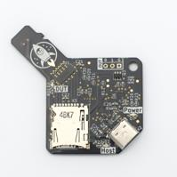

# 📺 HMI 관련

네트워크 기능이 없는 Nextion HMI에 OTA를 구현하기 위해 **microSD 슬롯 또는 시리얼 포트를 통한 펌웨어 업로드를 구현**해야 합니다.

## microSD 슬롯을 통한 구현

microSD는 4개의 핀(MOSI, MISO, SCK, CS)을 이용한 SPI 통신이나, SD 카드에서 고속 통신을 위해 설계된 SDIO 등을 통해 보드와 통신합니다.

이 통신들은 기본적으로 단일 마스터 기반 구조로, SPI든 SDIO든 **오직 하나의 마스터 보드와만 안정적으로 통신**할 수 있도록 설계되어 있습니다. 또한 FAT32를 주로 사용하는 **microSD의 파일 시스템은 멀티 엑세스를 고려하여 설계되지 않았으므로**, 동기화 없이 동시 접근하는 경우 파일 시스템이 손상될 수 있습니다.

microSD 슬롯을 통해 펌웨어 전달을 구현하기 위해서는 **물리적 MUX를 이용한 구현이 가장 가능성 있는 선택지**입니다.

조사 결과 호스트 PC와 임베디드 보드 간 물리적 microSD 이동 불편을 줄여주는 [USB-SD MUX](https://pengutronix.de/en/blog/2024-09-10-usb-sd-mux-fast.html)같은 재미있는... 물건도 찾을 수 있었지만, 산업계에서 일반적으로 사용되지 않을 뿐더러 [독일에서 해외 배송되는 고가의 장비](https://shop.linux-automation.com/index.php?route=product/product&product_id=72) 외 다른 저렴한 모델을 찾을 수 없었습니다. 단순 USB-SD 커넥터 두 개를 납땜하여 직접 제작하는 것은 아무리 소프트웨어적으로 제어한다 하더라도 안정성이 너무 낮을 것으로 예상됩니다.

때문에 **microSD 슬롯을 통한 펌웨어 OTA는 물리적 한계로 인해 구현이 어려운 상황**입니다.

## 시리얼 포트를 통한 구현

Nextion HMI는 microSD를 통한 펌웨어 업데이트 외에도 **시리얼 포트를 통한 업데이트를 지원**합니다.

Nextion 브랜드를 소유한 ITEAD 사에서 제공하는 라이브러리([itead/ITEAD_Arduino_Nextion](https://github.com/itead/ITEADLIB_Arduino_Nextion)) 및 해당 라이브러리를 기반으로 ESP8266 & ESP32용으로 개발된 라이브러리([Nredor/ESPNexUpload](https://github.com/Nredor/ESPNexUpload))가 제공되기는 하지만, 수년 이상된 자료들이라 정상적으로 적용할 수 있을 지는 알 수 없습니다.

실제로 Nextion 브랜드 홈페이지의 [FAQs](https://nextion.tech/faqs/)에서도 다음과 같이 명시하고 있습니다.

> Newer components and **Intelligent Series support has not been added.**
>
> However, most components can “borrow” from another existing component and then be extended to suit your needs.

저희가 사용할 HMI 모델의 경우 Intelligent Series 제품으로, 아직 라이브러리에서 공식 지원하지 않고 있으며 때문에 공식 문서를 참고하며 라이브러리를 직접 수정하여 사용해야 합니다.

하지만 업로드 프로토콜을 설명하는 해당 문서 자체가 이미 6년이 넘은 자료인데다, 업로드 프로토콜을 구현한 라이브러리마다 사용한 프로토콜 버전이 다르고, 타 버전의 프로토콜 설명 문서가 확인되지 않는 등, **실제 구현에 어려움이 많고 시간이 얼마나 소요될지 알 수 없는 상황**입니다.

## 제안

조사 중에 저희 졸업과제에 사용하기 매우 적합해보이는 HMI를 발견했습니다. 저희가 기존에 네트워크 모듈로 사용하려고 했던 **ESP32 보드에 터치 디스플레이가 부착된 제품**입니다!

[5.0 inch model](https://www.devicemart.co.kr/goods/view?no=15667739) / [7.0 inch model(해외구매)](https://www.icbanq.com/P016493006?srsltid=AfmBOooEBAykRUyKoOn1eymJBBd6zu85W6jPrFNvOo_xTZONUCNYwuqn)

ELECROW사의 Crowpanel 5.0 인치 / 7.0 인치 ESP32 터치 디스플레이입니다. **MCU에서 실행할 펌웨어에 GUI가 포함되어 실행**되며, 광고에 사용할 **미디어 파일을 TF 카드에서 로드하여 사용**할 수 있습니다. Arduino IDE같은 임베디드 보드 개발 IDE를 이용해 개발할 수 있고, 심지어 Visual Studio Code에서도 확장 프로그램을 설치하여 개발할 수 있습니다.

UI는 주로 임베디드 시스템을 위한 오픈 소스 그래픽 라이브러리 **LVGL(Light and Versatile Graphics Library)을 이용하여 구현**되며, SquareLine Studio과 같은 UI 디자인 툴과 호환되어 GUI를 편하게 구현할 수 있습니다.

OTA, 펌웨어-광고 로직 분리, 편리한 전원 구성, Arduino 추가 용이 등 저희가 처음 예상했던 HMI의 기능들을 모두 구현할 수 있는 최적의 선택지로 보입니다.

### 주요 사양

- 디스플레이: 5.0 인치 / 7.0 인치 TFT-LCD, 800 × 480, TN 패널

- 터치 방식: 정전식

- MCU: ESP32-S3-WROOM-1-N4R8(듀얼코어 LX6, 최대 240MHz)

- 메모리: 4MB Flash, 8MB PSRAM

- 무선 통신: 2.4GHz Wi-Fi(802.11 b/g/n), Bluetooth 5.0

- 전원 공급: DC 5V, 2A

- 통신 포트: UART, GPIO, I2C

- 기타 포트: USB Type-C, TF 카드 슬롯, 스피커 포트, 배터리 포트

- 버튼: 부트, 리셋

- 지원 개발 환경: Arduino IDE, Espressif IDF, PlatformIO, MicroPython

- 그래픽 라이브러리: LVGL 지원

- UI 디자인 툴: SquareLine Studio 호환

- 예제 및 자료: LVGL 데모 인터페이스 및 Arduino 예제 포함

### 졸업과제 프로젝트에 적합한 이유

1. **네트워크 기능이 포함된 디스플레이의 필요성**

   시리얼 포트를 통해 통신하는 임베디드 환경의 특성 상, **MCU로 작동하는 HMI에 미디어 파일을 포함한 대용량 펌웨어를 시리얼 포트로 전송하는 것에 한계**가 있습니다. 때문에 **HMI 자체에 네트워크 기능이 포함되어 있는 것이 가장 필요한 상황**이지만 Nextion HMI는 별도의 네트워크 모듈을 포함하고 있지 않으며, 물리적으로 OTA를 구현하기 어려운 구성을 가지고 있습니다.
   
   CrowPanel은 ESP32-S3 기반 터치 디스플레이로, 이는 **OTA를 공식적으로 지원하는 SoC**입니다. Wi-Fi 모듈 내장으로 별도 통신 모듈 추가 없이 OTA를 구현할 수 있습니다.

2. **펌웨어-광고 로직 분리 가능**

   **광고 미디어만 변경하는 경우에도 펌웨어를 포함한 모든 파일을 업데이트하는 것은 매우 비효율적**입니다. Nextion HMI는 펌웨어에 광고 미디어 파일이 포함되어 업로드되기 때문에 **단순 광고 교체를 위해서 펌웨어 전체를 업데이트**해주어야 하고, 같은 이유로 **펌웨어와 광고 로직을 분리할 수 없습니다.**

   CrowPanel은 다양한 임베디드 보드 개발 IDE에서 유연한 개발이 가능하며, **TF 카드에서 미디어 파일을 받아 GUI에 사용하는 것이 가능**합니다. 덕분에 **펌웨어 전체의 업데이트 없이도 광고만 업데이트하는 로직 분리가 가능**합니다.

3. **구현 편리성**

   Nextion HMI에서 작동하는 펌웨어는 일반적으로 Nextion Editor를 통해 개발되는데, Nextion Editor는 GUI 프로그램을 개발하는 것은 편리하지만 그 외 **사용자 라이브러리 사용이나 복잡한 하드웨어 기능 구현이 불가능**합니다.

   ESP계열 MCU 기반의 CrowPanel은 Auduino IDE, MicroPython 등 비교적 친숙한 IDE를 통해 개발이 가능하고, 무엇보다 **사용자 라이브러리 사용 및 저수준 하드웨어 제어 로직 개발이 가능**합니다. 또한 현재 임베디드 GUI에 가장 널리 사용되는 **LVGL를 통한 GUI 개발이 가능**하며, **자료 또한 풍부**합니다.

4. **비용적 장점**

   기존 계획의 ESP32 모듈 + Nextion HMI는 졸업과제로 구현하기 위해 하드웨어를 마련할 때 비용적 부담을 무시할 수 없습니다.

   CrowPanel은 기존에 사용하려던 **ESP32 보드에 터치 디스플레이를 포함**하고 있으며, 단가가 Nextion HMI에 비해 저렴합니다. 이후 Bartooler 쪽에 OTA 구현을 위한 HMI의 불가피한 변경 제안 시에도 적절한 대안으로 제시할 수 있을 것으로 보입니다.

### 고려할 점

현재 상황에서는 CrowPanel이 가장 적합한 하드웨어로 보이고, [전반적인 평가](https://www.espboards.dev/blog/crowpanel-advance-7-inch-hmi-review/) 또한 준수하지만 몇몇 고려할만한 사항들이 있습니다.

- [CrowPanel에서 OTA 시](https://forum.elecrow.com/discussion/610/esp32-7-and-ota) [오류가 보고된 몇몇 사례](https://www.reddit.com/r/esp32/comments/1k34jdu/crowpanel_advance_43_screen_glitch_when_updating)가 있습니다. 하드웨어 안정성 부분은 실제 테스트를 통해 확인해보아야 할 부분입니다.

- 시리얼 통신에 필요한 UART 및 I2C 포트가 제공되지만, GPIO의 포트 수가 그리 많지 않으며 일부 핀은 내부에서 터치 디스플레이와 공유됩니다. 향후 확장이 필요한 경우에는 제약 사항이 될 수 있습니다.
